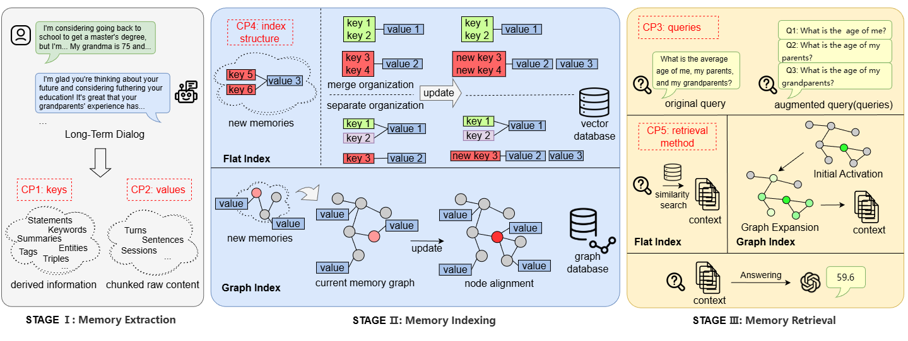

<div align="center">

# 记忆是否需要图？长期对话记忆的统一框架与实证分析

<div align="center">
  <div align="center">
    <p>
      <a href="https://arxiv.org/abs/2601.01280v2"></a>
      <a href="https://arxiv.org/abs/2601.01280v2"></a>
      <a href="README-zh.md"></a>
      <a href="README.md"></a>
    </p>
  </div>
</div>

<p align="center">
  
</p>
<p align="center" style="margin-top:-15px; font-style:italic; color:#f3f4f6;">统一框架图示</p>
</div>

---
## 目录

- [目录](#目录)
- [概述](#概述)
- [安装](#安装)
- [配置](#配置)
- [数据集](#数据集)
- [使用方法](#使用方法)
- [系统架构](#系统架构)
- [示例脚本](#示例脚本)
- [输出格式](#输出格式)
- [配置文件](#配置文件)
- [开发](#开发)
- [引用](#引用)
- [致谢](#致谢)
- [联系我们](#联系我们)

本仓库包含我们论文《记忆是否需要图？长期对话记忆的统一框架与实证分析》的代码。我们对长期对话记忆架构进行了实验性和系统导向的分析。提出了一个将对话记忆系统分解为核心组件，并支持基于图和非图的方法的统一框架。在此框架下，我们在LongMemEval和HaluMem数据集上进行了分阶段的完善实验，确定了稳定可靠的强基线，支持对各阶段组件的公平比较和实际部署。

## 概述

本仓库实现了一个统一的框架，用于构建和评估用于长期对话的、具备自主性的、可更新的记忆系统。核心能力包括：
- **支持flat与graph索引** - 包含了主流的非图、图两种记忆组织方法。
- **结构化记忆提取** — 提取会话级别的摘要、关键短语和用户事实。
- **动态记忆管理** — 使用相似性搜索和LLM判断来决定何时创建、更新或跳过记忆点。
- **灵活的后端** — 支持多种嵌入、检索和生成后端（Contriever, Stella, GTE, SentenceTransformers, OpenAI, BM25, gpt4o-mini, Lamma3.1-8B, openai api server）。
- **评估流程** — 为LongMemEval和HaluMem提供端到端工具：检索日志、召回率指标以及可选的答案生成。

## 安装

所需环境（建议）
- Python 3.10+ (推荐 3.11)
- conda 或者 pip + virtualenv/venv
- GPU + CUDA（用于本地大模型实验，可选）

快速设置 — 使用 conda（推荐）

```bash
# 创建 conda 环境并激活（示例）
conda create -n meminsight python=3.11 -y
conda activate meminsight

# 安装依赖
pip install -r requirements.txt
```

环境变量示例，环境变量会被配置文件里的设置所覆盖。

```bash
# 设置必要的环境变量
export OPENAI_API_KEY="your-api-key"  # 用于 OpenAI 模型
export HF_HOME="/path/to/cache"        # HuggingFace 模型的缓存目录
```

## 配置

本仓库支持分层的 `.env` 文件。加载器按以下顺序检查（并加载）这些文件：
1. 终端环境变量
2. 项目根目录`.env`
3. 子目录`.env`
4. 命令行参数

推荐的环境变量（见 `.env.example`）：
- `OPENAI_API_KEY` ：用于 OpenAI 兼容 LLM 后端的 API 密钥。
- `OPENAI_BASE_URL`：本地或者第三方 vLLM/OpenAI 兼容服务器的基础 URL (例如 `http://localhost:8001/v1`)。
- `LLM_MODEL`：用于生成的默认模型（例如 `gpt-4o-mini` 或 `meta-llama/Meta-Llama-3.1-8B-Instruct`）。
- `EMBEDDING_MODEL` / `EMBEDDING_RETRIEVER`：嵌入模型选择的默认值。
- `EMBEDDING_API_URL`, `EMBEDDING_API_KEY` 用于第三方嵌入模型的参数

详细的环境变量配置参照[配置文件](#配置文件)章节

## 数据集

### LongMemEval

LongMemEval (s/m) 包含 500 个问题，每个问题关联多个对话会话。下载指南请参考原始仓库。数据集默认存放位置为{project_root}/data/longmemeval-cleaned。

下载完成后，运行：

```bash
python data_preprocessing/lme_deduplicate.py
```
以对每个问题的会话ID进行去重（在索引前修复重复的会话元数据）。

### HaluMem

HaluMem 评估记忆系统处理幻觉和记忆更新的能力。

**数据集变体：**
- **HaluMem-Medium**: `data/HaluMem/HaluMem-Medium.jsonl` - 中等长度的对话
- **HaluMem-Long**: `data/HaluMem/HaluMem-Long.jsonl` - 包含干扰项的扩展对话

要下载 HaluMem，请遵循官方仓库 [链接](https://github.com/MemTensor/HaluMem)。数据集默认存放位置{project_root}/data/HaluMem，在我们的实验中只考虑了HaluMem-Medium，因为它已经足够有挑战性。

## 使用方法

### LongMemEval 评估

#### 非图方法

##### 0. 提取扩展内容
```bash
python data_preprocessing/lme_extract_summ.py
python data_preprocessing/lme_extract_keyphrase.py
python data_preprocessing/lme_extract_userfact.py
```
请注意，你需要在提取脚本中或通过其 CLI 参数设置输入数据路径和输出扩展路径，有关环境变量的设置，参照[配置](#配置)和[配置文件](#配置文件)章节。

##### 1. 运行检索
```bash
./scripts/lme_run_retrieval.sh
```
支持无扩展和多种扩展。

**关键参数：**
- `--retriever`: 从 `flat-bm25`, `flat-contriever`, `flat-stella`, `flat-gte`, `flat-openai` 中选择
- `--granularity`: 当前支持 `session`（会话级检索）
- `--index_expansion_method`: 逗号分隔的扩展方法列表：
  - `none`: 无扩展（仅原始会话）
  - `session-summ`: 会话摘要
  - `session-keyphrase`: 会话关键短语
  - `session-userfact`: 会话中的用户事实
  - 组合多个：`session-userfact,session-keyphrase,session-summ`
- `--index_expansion_result_join_mode`: 如何将扩展内容与原始内容结合：
  - `none`: 无扩展
  - `separate`: 保持扩展内容分离（从每个扩展中检索）
  - `merge`: 将扩展内容与原始会话合并；基于合并后的扩展和原始会话计算两个嵌入
  - `merge_raw`: 将原始会话合并到扩展中；只计算一个嵌入
- `--index_expansion_result_cache`: 逗号分隔的缓存文件路径（必须与扩展方法匹配）
- `--use_raw_session_as_key`: 同时使用原始会话对话进行检索
- `--value_expansion_join_mode`: 用扩展内容扩展检索到的值（`none` 或 `merge`）

**与原始 LongMemEval 的主要区别：**
1. 支持多种扩展
2. 支持多种扩展合并方法
3. 修复了 LongMemEval 中空索引扩展导致错误丢弃原始会话的问题
4. 修复了 LongMemEval 中改变会话 ID（更改 ‘answer’ 前缀）导致 ID 查找不匹配的问题

##### 2. 计算召回率指标
```bash
python evals/lme_compute_recall.py \
    --in_file <检索日志文件> \
    --oracle_file data/longmemeval-cleaned/longmemeval_oracle_deduplicate.json \
    --haystack_file data/longmemeval-cleaned/longmemeval_s_cleaned_deduplicate.json \
    --out_file <out_file> 
```

##### 3. 生成答案（可选）
```bash
python evals/lme_run_generation.py \
    --in_file <检索日志文件> \
    --model_name meta-llama/Meta-Llama-3.1-8B-Instruct \
    --topk_context 5 \
    --cot true \
    --out_dir <输出目录>
```
**生成参数：**
- `--topk_context`: 使用的顶部检索上下文数量
- `--history_format`: 历史记录格式（`json` 或 `nl`）
- `--useronly`: 仅使用用户话语（`true` 或 `false`）
- `--cot`: 启用思维链推理（`true` 或 `false`）
- `--merge_key_expansion_into_value`: 如何合并扩展（`none`, `merge`, `replace`）

##### 4. 评估 QA 性能
示例：
```bash
python evals/lme_compute_qa.py gpt-4o <生成输出文件> data/longmemeval-cleaned/longmemeval_oracle_deduplicate.json
```

---

#### 图方法

Graph 检索由两步构成：首先构建图，然后运行图检索脚本。逻辑上，flat 的 `--retriever`/`--index_expansion_method` 对应 graph 的 `--embedding`/`--graphrag-mode` 等。

##### 1. 构建图与运行检索
```bash
# 构建图（如果尚未构建）
./scripts/graph_lme_construct.sh \
  --in-file data/longmemeval-cleaned/longmemeval_s_cleaned.json \
  --out-dir data/graph_s-gpt-4o-mini \
  --embedding  text-embedding-3-small \
  --entity-namespace openai_name_entities

# 运行图检索
./scripts/graph_lme_run_retrieval.sh \
  --in-file data/longmemeval-cleaned/longmemeval_s_cleaned.json \
  --out-dir results/graph_lme/ \
  --embedding  text-embedding-3-small \
  --graphrag-mode entity,chunk,one-hot-expand \
  --only-need-context
```

##### 2. 计算召回率指标
graph 的检索输出（例如 `graph_retrieval_results-*.json`）结构与 flat 的检索日志兼容，因此可以直接复用 `evals/lme_compute_recall.py` 计算召回。
```bash
python evals/lme_compute_recall.py \
    --in_file <检索日志文件> \
    --oracle_file data/longmemeval-cleaned/longmemeval_oracle_deduplicate.json \
    --haystack_file data/longmemeval-cleaned/longmemeval_s_cleaned_deduplicate.json \
    --out_file <out_file> 
```

##### 3. 生成答案与评估 QA 性能（可选）
使用生成（QA）评估时，若输入是 graph 检索得到的 `graph_retrieval_results-*.json`，可以将其传给 `lme_run_generation.py`，生成流程与 flat 完全相同。
```bash
python evals/lme_run_generation.py \
    --in_file <检索日志文件> \
    --model_name meta-llama/Meta-Llama-3.1-8B-Instruct \
    --topk_context 5 \
    --cot true \
    --out_dir <输出目录>

python evals/lme_compute_qa.py gpt-4o <生成输出文件> data/longmemeval-cleaned/longmemeval_oracle_deduplicate.json
```

---

### HaluMem 评估

#### 非图方法

##### 1. 运行记忆系统评估
```bash
./scripts/halu_run.sh
```

**关键参数：**
**数据路径：**
- `--data_path`: HaluMem 数据集路径（`.jsonl` 格式）
- `--out_dir`: 结果输出目录
- `--cache_dir`: 模型缓存目录

**记忆系统配置：**
- `--embedding_model`: 用于检索的嵌入模型（`contriever`, `stella`, `gte`, `all-MiniLM-L6-v2` 等）
- `--retrieve_method`: 记忆检索策略：
  - `merge`: 将所有记忆组件（摘要、关键词、事实）合并到单个检索器中
  - `separate`: 为每个组件使用单独的检索器，然后合并分数
  - `merge_raw`: 与原始会话文本合并
- `--llm_model`: 用于记忆操作的 LLM (例如，`meta-llama/Meta-Llama-3.1-8B-Instruct`, `gpt-4o-mini`)
- `--llm_backend`: LLM 后端 (`openai` 用于 OpenAI 兼容 API)
- `--base_url`: LLM API 的基础 URL (例如，`http://localhost:8001/v1` 用于 vLLM)
- `--temperature`: LLM 生成的温度（默认：`0.0`）

**记忆操作：**
- `--enable_update`: 启用记忆更新操作（创建/更新/跳过决策）；如果为 False，则记忆总是被添加到系统中。
- `--keep_update_note`: 在更新操作后保留原始记忆（默认：True）
- `--enable_link`: 通过提示 LLM 来启用链接相关记忆
- `--use_neighbour_memories`: 使用相邻记忆来组合 top-k 上下文（必须启用 `--enable_link`）

**检索配置：**
- `--top_k`: 为 QA 检索的记忆数量（默认：`20`）
- `--qa_retrieve_method`: QA 检索方法：
  - `flatten`: 将所有记忆点展平进行检索，其中为每个点单独计算嵌入（默认）
  - `default`: 使用 `retrieve_method` 设置
- `--use_raw_session_as_key`: 在检索中包含原始会话对话；如果 `retrieve_method` 是 `merge_raw`，则必须为 True
- `--include_point_type`: 在检索到的上下文中包含点类型（摘要/关键词/事实）

**QA 配置：**
- `--qa_llm`: 用于 QA 的 LLM 模型（默认为 `llm_model`）
- `--qa_api_base`: 用于 QA LLM 的 API 基础 URL
- `--skip_qa`: 跳过 QA 生成（仅提取和检索记忆）

**处理配置：**
- `--version`: 输出文件的版本标识符
- `--resume`: 从现有进度恢复
- `--use_metadata_cache`: 使用缓存的提取元数据
- `--metadata_cache_dir`: 元数据提取缓存的目录
- `--device`: 嵌入模型的设备（如果未指定则自动检测）

**多进程：**
- `--num_workers`: 用于处理用户的并行工作线程数（默认：`1`）
- `--gpu_ids`: 逗号分隔的 GPU ID（例如，`"0,1,2,3"`）

##### 2. 评估结果
HaluMem 建议的默认配置在 `evals/.env` 中提供。
```bash
python evals/halu_eval.py \
  --file_path <structure_eval_results.jsonl>
```

---

#### 图方法

##### 1. 构建并运行图检索
```bash
# 构建并运行图检索
./scripts/graph_halu_construct.sh --in-file data/HaluMem/HaluMem-Medium.jsonl --llm-model gpt-4o-mini
./scripts/graph_halu_run_retrieval.sh \
 --graph-root data/nc-graph_halu_mem_medium-4o-mini \
 --out-dir results/graph_halu/ \
 --embedding text-embedding-3-small \
 --graphrag-mode entity,chunk,one-hot-expand \
 --only-need-context
```

##### 2. 生成中间文件并运行离线评估（推荐流程）
原先用于评估halumem的代码采用在线方式，边建图边记录相应实验结果，基于对模块化的考虑，我们推荐使用离线方式进行该部分评估。图方法的离线评估需先用 `evals/halu_graph_eval.py` 的 `--mode` 参数生成若干中间文件（例如 `add_memory_by_session.json`），再把检索结果与这些中间文件合并为离线评估输入，最后运行评估脚本计算指标。推荐步骤如下：

1. 生成 add_memory（解析 GraphML，输出 `add_memory_by_session.json`）
```bash
python evals/halu_graph_eval.py --mode add_memory \
  --graph_root data/nc-graph_halu_mem_medium-4o-mini \
  --out_path <输出文件目录>
```
该命令会在 `--out_path` 指定的位置写出 `add_memory_by_session.json`（如果未提供 `--out_path`，脚本会默认写入 `--graph_root`下）。

2. 用 `--retrieve_file_path` 指定检索结果文件（文件名或完整路径），或将图检索输出（`graph_retrieval_results-*.json`）放到同一目录（`data/nc-graph_halu_mem_medium-4o-mini/`），然后运行合并生成离线评估输入（`*_test_eval_results.jsonl`）。推荐在命令行显式指定输出文件 `--out_path`：
```bash
python evals/halu_graph_eval.py --mode gen_eval \
  --graph_root data/nc-graph_halu_mem_medium-4o-mini \
  --retrieve_file_path <检索文件路径> \
  --out_path <输出文件目录> \
  --dataset_path <Halumem数据集路径> \
  [--use_entity]
```
-- `--retrieve_file_path`：检索结果文件的路径或文件名（相对文件名会在 `--graph_root` 下查找）
- `--out_path`：输出目录。脚本会在该目录下写出基于检索文件名推断的结果文件，例如 `graph_retrieval_results-xxx.json` → `graph_retrieval_results-xxx_test_eval_results.jsonl`。若传入以 `.json` 或 `.jsonl` 结尾的路径，则视为完整文件路径（向后兼容）。
- `--out_suffix`：合并输出文件的后缀（默认 `_test_eval_results.jsonl`，仅在未指定具体输出文件名时用于推断）
- `--dataset_path`：HaluMem数据集路径
- `--use_entity`：可选，启用基于实体的上下文构建（否则使用 chunk-based 上下文）

这一步会在 `--out_path` 指定的目录（或检索文件旁边的默认位置）写出合并后的 JSONL（每行一个用户的评估输入），用于下游离线评估。

3. 运行离线评估
将上一步生成的 JSONL 提供给 `evals/halu_eval.py` 进行指标计算。例如：
```bash
python evals/halu_eval.py --file_path <path/to/*_eval_results.jsonl>
```
根据实际文件组织，你也可以把生成的 `*_test_eval_results.jsonl` 移到一个单独的 `results` 目录并以 `--file_path` 指向它所在目录。

说明：
- `--mode` 支持 `add_memory`（解析 GraphML）、`gen_eval`（合并并生成评估用 JSONL）、`test_llm`（快速测试 LLM 调用）。
- 请确保 `graph_halu_run_retrieval.sh` 的 `--out_dir` 或你移动/复制检索结果的位置与 `halu_graph_eval.py` 所期望的 `data/nc-graph_halu_mem_medium-4o-mini/` 路径一致，或者相应调整脚本的参数/环境变量 `PROJECT_ROOT`，以便正确读取检索结果并生成离线评估文件。


---

### 通用评测说明

本仓库中 `evals/` 目录下的评测脚本对 flat 与 graph 检测/召回评测是共通的。主要差别在于检索输出的生成方式和额外的图文件（GraphML）。

**通用流程（适用于 LongMemEval 与 HaluMem）：**
1.  **运行检索**（flat 或 graph）以生成检索日志（flat 通常输出为检索日志 JSON/JSONL，graph 输出为 `graph_retrieval_results-*.json` 并另外产出 GraphML 文件）。
2.  **计算召回**：使用 `evals/lme_compute_recall.py` 等脚本。
3.  **生成答案与评估 QA**（可选）：使用与 flat 相同的生成脚本 `lme_run_generation.py` 和 `evals/lme_compute_qa.py` 或 `halu_eval.py`。

**要点总结：**
- **共同点**：flat 与 graph 均产出可供 `evals/` 下通用脚本处理的检索日志（召回/QA 流程可复用）。
- **不同点**：graph 管道额外产出 GraphML 格式的建图结果，在halumem数据集上进行测评时使用离线方式；graph 的检索生成脚本名与输出路径通常不同（`graph_*` 前缀脚本）。
- **建议**：在比较 flat 与 graph 时保持相同的 oracle/haystack 输入文件与 top_k 设置，以确保评测可比性。


## 系统架构
### graph 核心组件

1. **GraphRAG** (`src/graph/graphrag.py`): 图检索的核心实现，负责图存储选择、图构建流程、聚类和查询参数管理。

2. **图构建入口** (`src/graph/lme_construct_graph.py`, `src/graph/halu_construct_graph.py`): 将 LongMemEval / HaluMem 的会话或问题转换成图表示并写入工作目录（包括 GraphML 文件和图存储）。

3. **图检索入口** (`src/graph/lme_run_retrieval.py`, `src/graph/halu_run_retrieval.py`): 使用 `GraphRAG` 执行图级查询，聚合图上检索结果并输出 JSON 检索日志。

4. **实体与图操作** (`src/graph/entity_extraction/extract.py`, `src/graph/_op.py`): 从会话文本抽取实体/关系、合并节点/边并上链到知识图的具体实现。

5. **LLM 与嵌入适配器** (`src/graph/_llm.py`, `src/graph/_utils.py`): 嵌入分发、调用 OpenAI / 本地 LLM 的适配逻辑以及图相关的工具函数。

6. **图存储基础** (`src/graph/base.py`): 抽象的图存储接口与基础实现（例如 NetworkX 存储适配器等），用于读写节点/边、查询与聚类支持。

说明：图组件产出的 GraphML 文件可用于离线检查与可视化；`evals/halu_graph_eval.py` 提供基于 GraphML 的评估流程。

### flat 核心组件

1. **AgenticMemorySystem** (`agentic_memory_system.py`): 核心记忆管理系统
   - 包含摘要、关键词和事实的结构化记忆笔记
   - 动态记忆操作（创建/更新/合并）
   - 多嵌入模型支持
   - 记忆链接和邻居感知操作

2. **LLMController** (`llm_controller.py`): LLM 接口抽象
   - 不同 LLM 后端的统一接口
   - 具有重试逻辑的结构化输出解析
   - 令牌计数和上下文管理

3. **StructuredMemoryRetriever** (`halu_utils.py`): HaluMem 特定包装器
   - 基于会话的记忆管理
   - 元数据提取和缓存
   - 记忆操作跟踪

4. **FlexibleEmbeddingRetriever** (`agentic_memory_system.py`): 检索后端
   - 多模型支持（Contriever, Stella, GTE, SentenceTransformer, OpenAI, BM25）
   - 高效的批量编码
   - 基于相似性的检索

### 检索方法

- **`merge`**: 将所有记忆组件合并到单个检索索引中
- **`separate`**: 为摘要、关键词和事实维护单独的索引，然后聚合分数
- **`merge_raw`**: 在结构化组件之外包含原始会话文本

### 记忆更新策略

当处理新的会话时，系统：
1. 提取结构化元数据（摘要、关键词、事实）
2. 检索相似的现有记忆
3. LLM 决定：**创建**新记忆、**更新**现有记忆，或**跳过**（冗余）
4. 更新被合并，同时保留所有原始会话 ID 用于评估

## 示例脚本

### 带有多种扩展的 LongMemEval

```bash
bash scripts/lme_run_retrieval.sh \
    data/longmemeval-cleaned/longmemeval_m_cleaned.json \
    flat-stella \
    session \
    session-userfact,session-keyphrase,session-summ \
    merge \
    "data/longmemeval-cleaned/expansions-llama3.1_8b/session-userfact.json,data/longmemeval-cleaned/expansions-llama3.1_8b/session-keyphrase.json,data/longmemeval-cleaned/expansions-llama3.1_8b/session-summ.json" \
    llama-3.1-8b-instruct-ICL \
    my_experiment
```

### 包含完整管道的 HaluMem

```bash
# 运行评估
bash scripts/halu_run.sh \
    --dataset long \
    --embedding-model stella \
    --retrieve-method merge \
    --llm-model meta-llama/Meta-Llama-3.1-8B-Instruct \
    --base-url http://localhost:8001/v1 \
    --enable-update \
    --keep-update-note \
    --use-metadata-cache \
    --resume \
    --version full_pipeline_exp
```

### Graph 使用示例

下面展示如何用仓库提供的脚本构建图并运行基于图的检索（LongMemEval / HaluMem）。输出包括每个问题/会话的 GraphML 文件和 `graph_retrieval_results-*.json`。

```bash
# 为 LongMemEval 构建图
./scripts/graph_lme_construct.sh \
  --in-file data/longmemeval-cleaned/longmemeval_s_cleaned.json \
  --out-dir data/graph_s-gpt-4o-mini \
  --embedding  text-embedding-3-small \
  --entity-namespace openai_name_entities

# 为 LongMemEval 运行基于图的检索
./scripts/graph_lme_run_retrieval.sh \
  --in-file data/longmemeval-cleaned/longmemeval_s_cleaned.json \
  --out-dir results/graph_lme/ \
  --embedding  text-embedding-3-small \
  --graphrag-mode entity,chunk,one-hot-expand \
  --only-need-context

# 为 HaluMem 构建图并运行检索
./scripts/graph_halu_construct.sh \
 --in-file data/HaluMem/HaluMem-Medium.jsonl \     --llm-model gpt-4o-mini

./scripts/graph_halu_run_retrieval.sh \
 --graph-root data/nc-graph_halu_mem_medium-4o-mini \
 --out-dir results/graph_halu/ \
 --embedding text-embedding-3-small \
 --graphrag-mode entity,chunk,one-hot-expand \
 --only-need-context
```

说明：
- 使用 `--graphrag-mode`（或环境变量 `GRAPHRAG_MODE`）选择图组件（例如：`entity`, `chunk`, `one-hot-expand`, `rank-entity`）。
- 输出目录中会包含用于离线检查的 GraphML 文件和 `graph_retrieval_results-*.json` 检索日志，供 `evals/halu_graph_eval.py` 使用。

## 输出格式

### LongMemEval 检索日志

输出文件中的每一行包含：
```json
{
  "question_id": "user123_session5_q1",
  "question_type": "single_event",
  "question": "What did I order for lunch?",
  "answer": "You ordered a chicken salad.",
  "question_date": "2024-03-15",
  "haystack_dates": ["2024-03-10", "2024-03-12", ...],
  "haystack_session_ids": ["user123_session1", "user123_session2", ...],
  "answer_session_ids": ["user123_session3"],
  "retrieval_results": {
    "query": "What did I order for lunch?",
    "ranked_items": [
      {
        "corpus_id": "user123_session3",
        "text": "...",
        "timestamp": "2024-03-12",
        "is_original": true,
        "expansion_type": "original"
      },
      ...
    ]
  }
}
```

### HaluMem 结果

结果保存在 `<out_file_path>/`：
- `*_eval_results.jsonl`: 包含检索到的上下文和生成答案的每个问题的结果
- `user_*.json` (在 `tmp/` 中): 包含记忆操作的中间用户级别结果
- 记忆操作日志和统计信息

## 配置文件

本仓库通过环境变量与分层 `.env` 文件驱动运行时配置。配置加载顺序：
1. 终端环境变量
2. 项目根目录 `.env`
3. 子目录（例如 `evals/`）中的 `.env`
4. 命令行参数

下面列出仓库中常用的环境变量（默认见仓库根目录的 `.env.example`）：

- `OPENAI_API_KEY`：OpenAI 或 OpenAI 兼容后端的 API Key（默认：空字符串）。
  - 用途：用于调用 OpenAI API、第三方兼容服务器或代理（例如 vLLM/OpenAI-compat 服务）。

- `OPENAI_BASE_URL`：OpenAI 兼容服务的基础 URL（默认：`http://localhost:8001/v1`）。
  - 用途：当使用自托管的 vLLM/OpenAI-compat 服务时设置，例如 `http://localhost:8001/v1`。

- `LLM_MODEL`：默认用于生成的模型（默认：`gpt-4o-mini`）。
  - 示例：`gpt-4o-mini`、`gpt-4o`、`meta-llama/Meta-Llama-3.1-8B-Instruct`。

- `EMBEDDING_MODEL`：用于向量化的嵌入模型（默认：`text-embedding-3-small`）。
- `EMBEDDING_RETRIEVER`：嵌入检索器选择（默认：`flat-openai`）。

- `EMBEDDING_API_URL`：可选的第三方嵌入服务 URL（默认：空）。
- `EMBEDDING_API_KEY`：用于 `EMBEDDING_API_URL` 的 API Key（默认：空）。
  - 说明：当使用外部嵌入提供商时，系统会 POST `{ "model": ..., "input": [...] }` 并期望 OpenAI-like 响应结构。

- `CACHE_DIR`：模型/数据缓存目录（默认：`data/cache`）。

- `NUM_WORKERS`：多进程/并行任务的默认进程数（默认：`64`，数据预处理场景可调整）。
- `SAVE_EVERY`：长任务中断点保存频率（默认：`256`）。

- `LLM_TEMPERATURE`：LLM 推理的默认温度（默认：`0.0`）。
- `QA_LLM`：默认用于 QA 的 LLM（默认：`gpt-4o-mini`）。

- `KEYPHRASE_MAX_TOKENS`、`KEYPHRASE_TEMPERATURE`：关键短语抽取默认参数（分别默认 `100`、`0.0`）。
- `SUMMARY_MAX_TOKENS`、`SUMMARY_TEMPERATURE`：摘要抽取默认参数（分别默认 `500`、`0.0`）。
- `USERFACT_MAX_TOKENS`、`USERFACT_TEMPERATURE`：用户事实抽取默认参数（分别默认 `2000`、`1.0`）。

示例：在 Linux/macOS shell 中设置环境变量的方式：
```bash
export OPENAI_API_KEY="your_api_key"
export OPENAI_BASE_URL="http://localhost:8001/v1"
```

建议：将项目级默认值放入根目录 `.env` 文件（仓库已包含 `.env.example`），并在需要的子目录（例如 `evals/`、`data_preprocessing/`）放置特定于该子流程的覆盖 `.env` 文件。

下面说明当前仓库对模型的支持：
### 模型支持

**嵌入模型：**
- `contriever`: Facebook Contriever
- `stella`: Stella-1.5B-v5
- `gte`: GTE-Qwen2-7B-instruct
- `all-MiniLM-L6-v2`, `all-mpnet-base-v2`: SentenceTransformers
- `openai`: OpenAI embeddings (默认为 text-embedding-3-small/small)
- `bm25`: BM25 稀疏检索

**LLM 模型：**
- OpenAI 模型：`gpt-4o-mini`, `gpt-4` 等
- 通过 vLLM 的本地模型：`meta-llama/Meta-Llama-3.1-8B-Instruct` 等
- 通过环境变量设置的第三方api服务

## 开发

### 项目结构

```
.
├── README.md                   # 英文说明
├── README-zh.md                # 本文件（中文说明）
├── data/                       # 原始数据与处理后输出（HaluMem, LongMemEval 等）
├── data_preprocessing/         # 数据预处理与扩展脚本
│   └── lme_deduplicate.py      # LongMemEval 去重示例
├── src/                        # 核心代码：flat 与 graph 两套管道
│   ├── config.py               # 环境与配置加载器（.env 分层）
│   ├── flat/                   # 非图索引（embedding-based）实现
│   │   ├── agentic_memory_system.py
│   │   ├── halu_run.py
│   │   ├── halu_utils.py
│   │   └── llm_controller.py
│   └── graph/                  # 基于图的管道（GraphRAG 等）
│       ├── graphrag.py
│       ├── lme_construct_graph.py
│       ├── halu_construct_graph.py
│       └── lme_run_retrieval.py
├── evals/                      # 评估脚本（召回、QA、graph eval）
│   ├── halu_eval.py
│   ├── halu_graph_eval.py
│   ├── lme_compute_recall.py
│   └── lme_compute_qa.py
├── scripts/                    # 运行示例脚本（构建/检索/评估）
│   ├── halu_run.sh
│   ├── lme_run_retrieval.sh
│   ├── graph_lme_construct.sh
│   └── graph_lme_run_retrieval.sh
├── model_cache/                # 本地模型缓存（hub）
├── sample_data/                # 小型示例数据
└── README.assets/              # 文档图片/资源
```

说明：上面为仓库的简化视图，实际目录下还包含更多可能的脚本、配置文件与输出目录（例如 `data/*`、`checkpoints/`下的模型快照等）。

### 与 vLLM 一起运行

要通过 vLLM 使用本地 LLM：

```bash
# 启动 vLLM 服务器
python -m vllm.entrypoints.openai.api_server \
    --model meta-llama/Meta-Llama-3.1-8B-Instruct \
    --port 8001 \
    --tensor-parallel-size 1

# 运行评估，指向 vLLM 服务器
python halu_run.py \
    --llm_model meta-llama/Meta-Llama-3.1-8B-Instruct \
    --base_url http://localhost:8001/v1 \
    ...
```

## 引用

<!-- TODO: 论文发表后添加引用信息 -->


## 致谢

本工作建立在以下工作之上：
- **LongMemEval**: 长期记忆评估基准 [链接](https://github.com/xiaowu0162/LongMemEval)
- **HaluMem**: 幻觉感知记忆评估数据集 [链接](https://github.com/MemTensor/HaluMem)
- **A-Mem**: 具备自主性的可更新记忆系统 [链接](https://github.com/agiresearch/A-mem)
- **nano-graph**: 简化的GraphRAG实现 [链接](https://github.com/gusye1234/nano-graphrag)

## 联系我们

<!-- TODO: 添加联系信息 -->